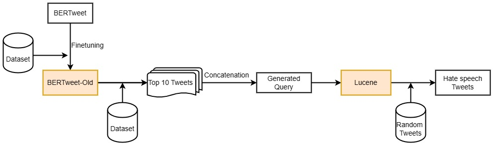

# Hate Speech Detection in Tweets

Author: Rupal Jain [jainrupal@arizona.edu](mailto:jainrupal@arizona.edu), Sarah Hyunju Song [hyunjusong@arizona.edu](mailto:hyunjusong@arizona.edu)

Date: May 23, 2023

## Overview

The project aims to tackle the prevalent issue of hate speech and abusive language in tweets, leveraging the popularity and widespread use of Twitter as a platform for expressing opinions, sharing thoughts, and engaging in conversations. As social media continues to play a significant role in shaping public discourse, it is crucial to address the rising tide of online hate speech and its negative impact on individuals and communities. With recent advancements in AI text generation, the concern further intensifies as these language models are trained on large volumes of online text, including hate speech, thereby potentially perpetuating biased and harmful content. This project focuses on developing mechanisms to detect hate speech in tweets and promote the generation of non-biased text. Different approaches that are based on the topics covered in the course were experimented for our specific task. We show a diagram that outlines our pipeline to detect hate speech in Fig 1, and the improved approach of this pipeline in Fig 2. 



*Fig. 1*: *The diagram illustrates our pipeline for hate speech detection*.


*Fig. 2*: *The diagram illustrates the enhanced iteration of the model, where the components highlighted in red have been incorporated to enhance the system's performance.*.

## Setup the program

You will need to set up an appropriate coding environment.
Minimally, you should install:

* [git](https://git-scm.com/downloads)
* [Java](https://www.java.com/en/)(8 or higher)
* [Maven](https://maven.apache.org/)
* Sign up for the Twitter developer portal and get the Twitter API (consumerKey, consumerSecret, accessToken, accessTokenSecret) and store it in config.properties file in the root folder

## Execution

Please follow the below guidelines to run the program:

Compatibility:
Browser: Google Chrome, Microsoft Edge; OS: Windows, MAC

### Neural Network in Jupyter Notebook

We used jupyter notebooks for the development of the neural network. In our github repository of the folder neural network, there are several jupyter notebooks that were used for the development of the classifiers. 
-	Improved_Neural_Network_Text_Retrieval(CSC583)_Project.ipynb : contains the fine tuning process of the BERTweet on our datasets to develop a hate speech classifier.
-	Combined_Neural_Network.ipynb : contains the finetuning on the combined dataset to develop a hate speech classifier.
-	HateSpeech_Classifier.ipynb: contains the code that uses the fine tuned model to classify the test dataset directly
-	Hate_Speech_Lexicon_Build.ipynb : contains the code that generates the lexicon query string for the improvement method of the Lucene model approach.

### Lucene in Java

To run the Java code from the command line, follow the steps below:

1.	Firstly, copy the below repository to your local directory by executing:

```
git clone https://github.com/RupalJain97/Text-Retrieval-Project
```

2.	Open the terminal or command prompt and navigate to the folder where the repository has been cloned using the cd command. For example, if the repository is cloned in the "project" folder, you can navigate to it using:

```
cd project
```

3.	Once you are in the correct folder, execute the following command to compile the Java code:

```
javac src/main/java/edu/arizona/cs/QueryEngine.java
```

This command compiles the Java source file QueryEngine.java located in the specified path.

4.	After the compilation is successful, you can run the Java program using the java command followed by the fully qualified class name. For example, if the main class is QueryEngine located in the edu.arizona.cs package, you can run it using:

```
java edu.arizona.cs.QueryEngine
```

## References

* https://developer.twitter.com/en/docs/twitter-api/getting-started/getting-access-to-the-twitter-api
* https://huggingface.co/pysentimiento/bertweet-hate-speech
* https://github.com/aymeam/Datasets-for-Hate-Speech-Detection
* https://twitter4j.org/configuration
* https://jar-download.com/artifacts/org.twitter4j/twitter4j-core/4.0.6/source-code/twitter4j/Paging.java
* https://twitter4j.org/oldjavadocs/2.2.5/twitter4j/Query.html
* https://developer.twitter.com/en/support/twitter-api/error-troubleshooting
